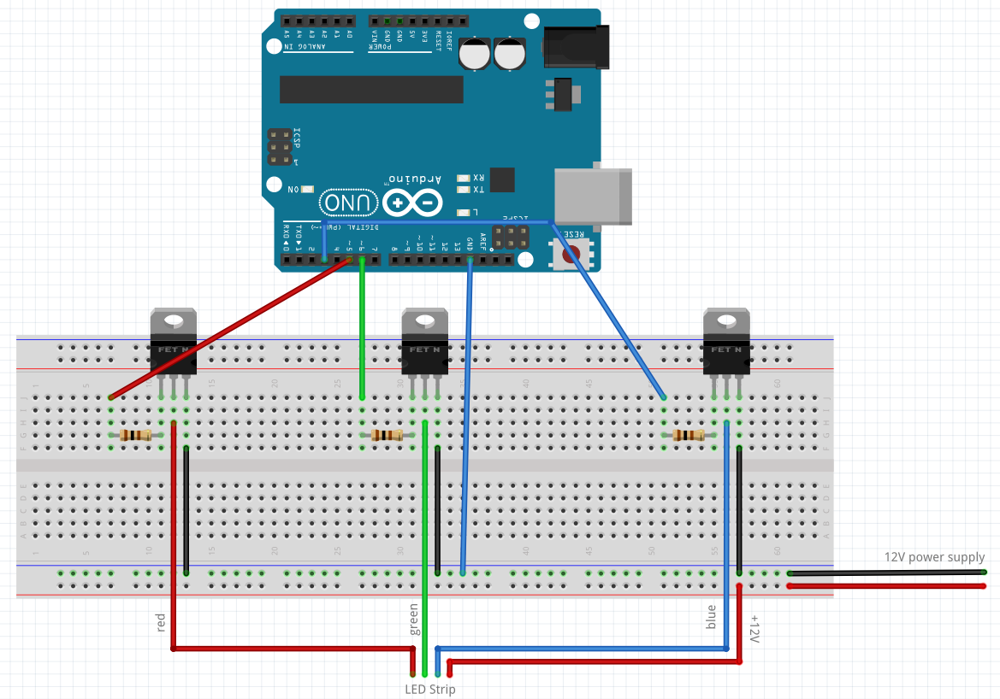

# CSGO: Game State Integration to Arduino

Send CSGO:GSI datas to Arduino throught serial communication

### Prerequisites

```
Python 2
PIP
```

### Materials

* Arduino (Uno, Mega, Mini...)
* 3 resistors 100Ω
* 3 N-Channel MOSFETs (*TODO: Add refs.*)
* 12V LED Strip RGB 4 Pins

### Installing

```
$ git clone https://github.com/synyster0fa7x/csgo-gsi-to-arduino.git
$ cd csgo-gsi-to-arduino
$ python -m pip install -r requirements.txt
$ cp config.json.dist config.json
```

Fill `config.json` with your parameters then launch the server with :

```
python main.py
```

The server is now listenning for POST request then send the datas to your Arduino throught serial COM.

### Wiring

Follow this sketch :


## Built With

* [Python](https://www.python.org/)
* [CSGO:GSI](https://developer.valvesoftware.com/wiki/Counter-Strike:_Global_Offensive_Game_State_Integration) - CSGO: Game State Integration documentation

## Authors

**Anthony Tournier** - *Initial work* - [synyster0fa7x](https://github.com/synyster0fa7x)

## License

This project is licensed under the MIT License - see the [LICENSE.md](LICENSE.md) file for details.